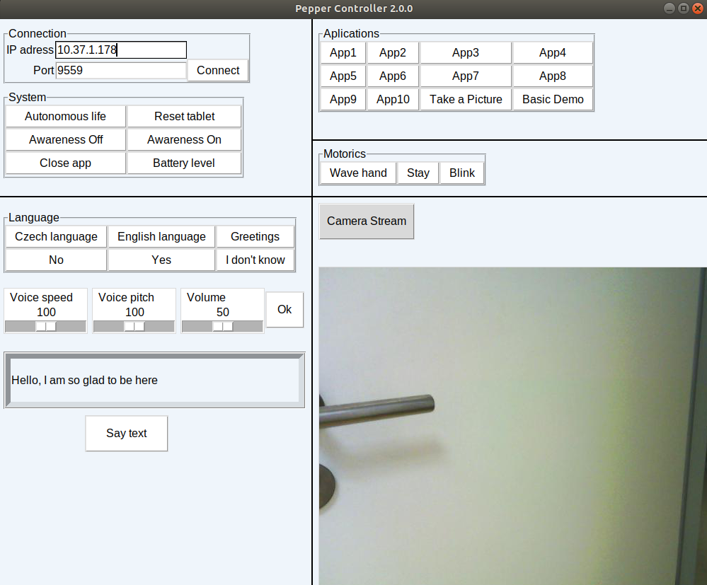

# Pepper Controller

This is a software to control Pepper humanoid robot from Python. You can easily connect to robot and control it from the command line or GUI interface. This software has to be replacement for Choreographe tool, that offer only graphical programming instead of full Python support. You can also control robot, run apps or teleoperate the robot from the GUI interface. The example scripts will help  you to learn how to write Pepper app in few lines Python of code without necessity to use Softbank software.   

## System requirements

Ubuntu up to 20.04 

Python 2.7

Pepper humanoid robot

## Installation

Install Pepper SDK 2.5.10 library for Python 2.7 from: https://www.softbankrobotics.com/emea/en/support/pepper-naoqi-2-9/downloads-softwares

Add path to your .bashrc: 

`export PYTHONPATH=${PYTHONPATH}:~/pynaoqi/lib/python2.7/site-packages` 

Test the library:

`python2`

`import naoqi`

Clone this repository to your computer:

`git clone https://github.com/incognite-lab/Pepper-Controller.git`

`cd Pepper-Controller`

Install dependencies

`pip2 install -r ./requirements.txt` 

## GUI Interface

The easist way to control Pepper robot is via the GUI interface:

`python2 peppergui.py`

The window will appear:

Firstly you need to enter corrent IP address (press the robot chest button to obtain it) to the upper left box and press "Connect"

After succesfull connection you can control the robot by pressing the buttons.

You can start the application by clicking the button with it's name in the section "Applications". This will run Pepper internal applications. 

If you want Pepper to say the phrase chosen by you enter it in the field above "Say text" button and then press it.

If you want to change the behavior of the GUI just edit [conf.yaml](conf.yaml) file.

## Command line examples

If you want to control robot from command line just run Python and type:

`import naoqi`

`from pepper.robot import Pepper`

`robot = Pepper(PeppperIP,9559)`

Now you can control Pepper from command line. Pepper can say somenthing:

`robot.say("Hello, I am Pepper robot.")`

If you want to Pepper to show the web on tablet type:

`robot.show_web("https://www.google.com/")`

You can esaily turn off Autonomous life:

`robot.autonomous_life_off()`

## Writing custom application

As you can see from previous examples, it is pretty straigforward to write application in Python without Choreographe.

We prepared two examples, that you can use as a templates for the developmnent of your own application. 

First one presents basic robot capabilities:

`python hellopepper.py`

Feel free to edit the script [file](hellopepper.py) according to your needs.

The second example shows more complex application:

`python demo.py`

You can also use this [script](demo.py) as a starting point to write your application.

## List of methods

The core of our software is Pepper class, that is wrapper around naoqi. It will help you to write Python applications. Here is a list all methods in Pepper class.

show_image

getVoiceSpeed

getVoiceShap

getVoiceVolume

test_say

stand

rest

point_at

turn_around

autonomous_blinking

greet

show_web

detect_touch

tablet_show_settings

reset_tablet

stop_behaviour

dance

autonomous_life

restart_robot

shutdown_robot

autonomous_life_off

autonomous_life_on

set_volume

battery_status

blink_eyes

turn_off_leds

start_animation

start_behavior

list_behavior

get_robot_name

hand

track_object

take_picture

exploration_mode

show_map

robot_localization

stop_localization

load_map

subscribe_camera

unsubscribe_camera

get_camera_frame

get_depth_frame

show_tablet_camera

navigate_to

unsubscribe_effector

pick_a_volunteer

share_localhost

play_sound

stop_sound

get_face_properties

listen_to

listen

ask_wikipedia

rename_robot

upload_file

download_file

speech_to_text

chatbot

streamCamera

recordSound

changeVoice

set_awareness

move_forward

set_security_distance

move_head_down

move_head_up

move_head_default

move_to_circle

move_joint_by_angle
